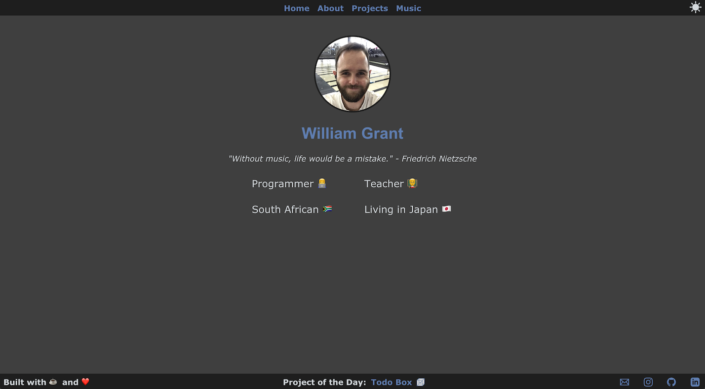

# Simple Portfolio Website

Finally a portfolio website I'm satisfied with. It's static and simple as intended.

- Designed with HTML, SASS & a pinch of JS.

- Built for beginner developers and easy to use. No need for any specific frameworks or tools. This does mean that there is a lot of redundant code. C'est la vie.

## Please Note
- The default theme is the dark theme.
- All the styling for the website is stored in [main.css](main.css) which is compiled from the [sass](sass) directory.

If you only have CSS knowledge feel free to delete the [sass](sass) directory and edit the [main.css](main.css) file directly.
However, I do recommend learning [SASS](https://sass-lang.com) because it will *change your life*.

The [main.css](main.css) is formatted to be easy to read and not necessarily easy to code. If you use a program like [Scout-App](https://scout-app.io) you can recompile the [main.css](main.css) file using differnt formats e.g. (expanded, compact, compressed) to a style that suits you.

## How to use
1. Download this respository
2. Edit the HTML files with your information.
3. Tweak the website's themes as you see fit in either [main.css](main.css) or in [sass](sass).
  1. SASS Route I recommend that you download [Scout-App](https://scout-app.io) to compile the SASS to CSS. It's super easy to use and you don't need to fiddle with the command line.
  2. For the SASS complication process your source is [sass](sass) and the output is the base directory.
  3. It should compile and overwrite [main.css](main.css).
4. Open [index.html](index.html) in your browser and see what you think.

## TODO
- [ ] Refactor Stylesheet

## Screenshots

### Desktop

### Mobile

## Things that helped and inspired me
Site Look
- Indigo Minimalist Jekyll Template [https://github.com/sergiokopplin/indigo](https://github.com/sergiokopplin/indigo)

Social Media Icons:

- [Iconmonstr](https://iconmonstr.com/)
- [Svgrepo](https://www.svgrepo.com/)

Stopping the nav and footer bouncing when scrolling

- https://www.smashingmagazine.com/2018/08/scroll-bouncing-websites/

Dark and light mode toggle

- The most simple way to toggle a light and dark theme when using SASS on a static website. Trust me I spent hours looking into this…
- https://flaviocopes.com/dark-mode/
- **NB** When working on this locally the theme switch won't work in safari. This has something to do with safari thinking the javascript is unsecure since it is being run from a local directory. Everything is fine once you host it online.
